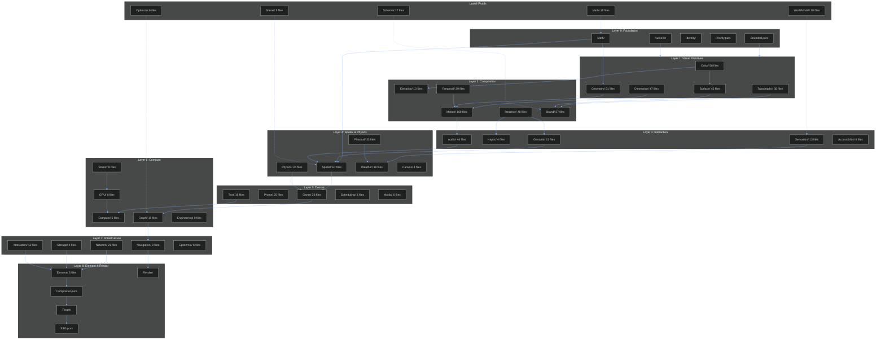
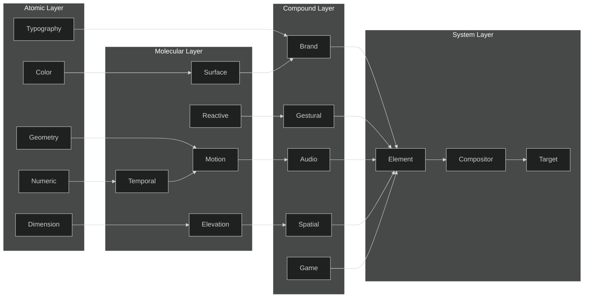
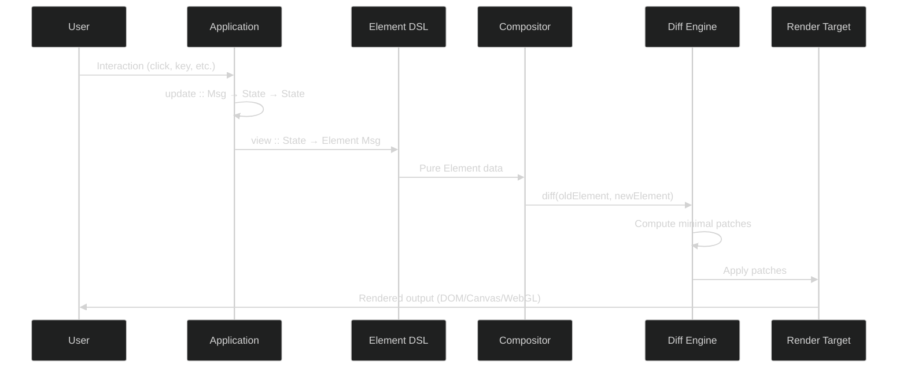
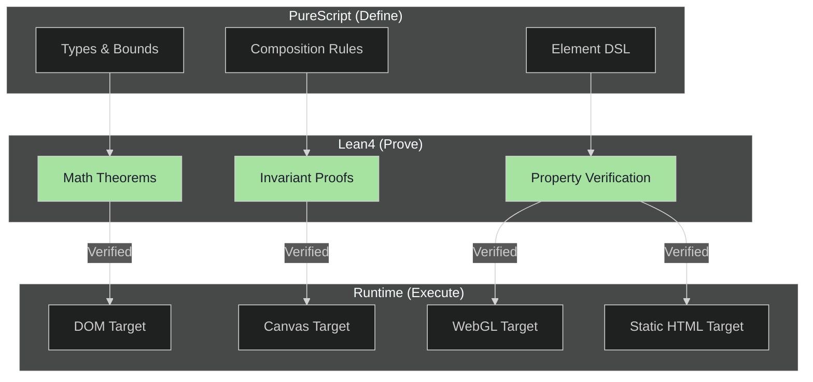
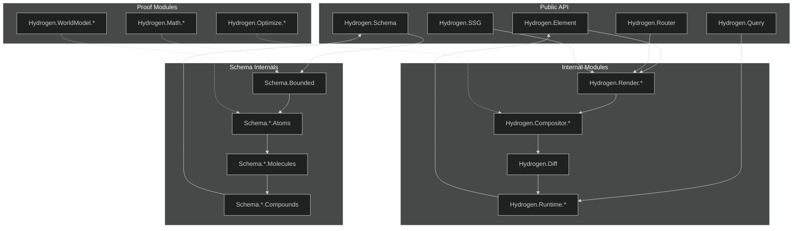
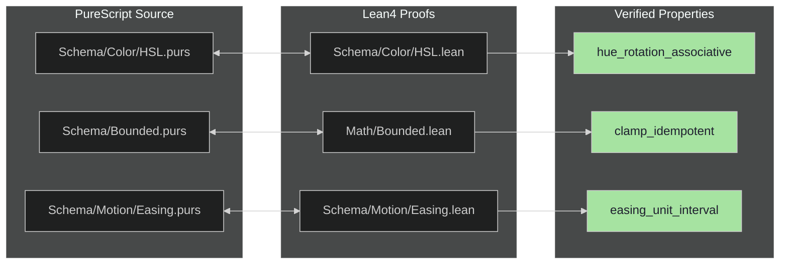
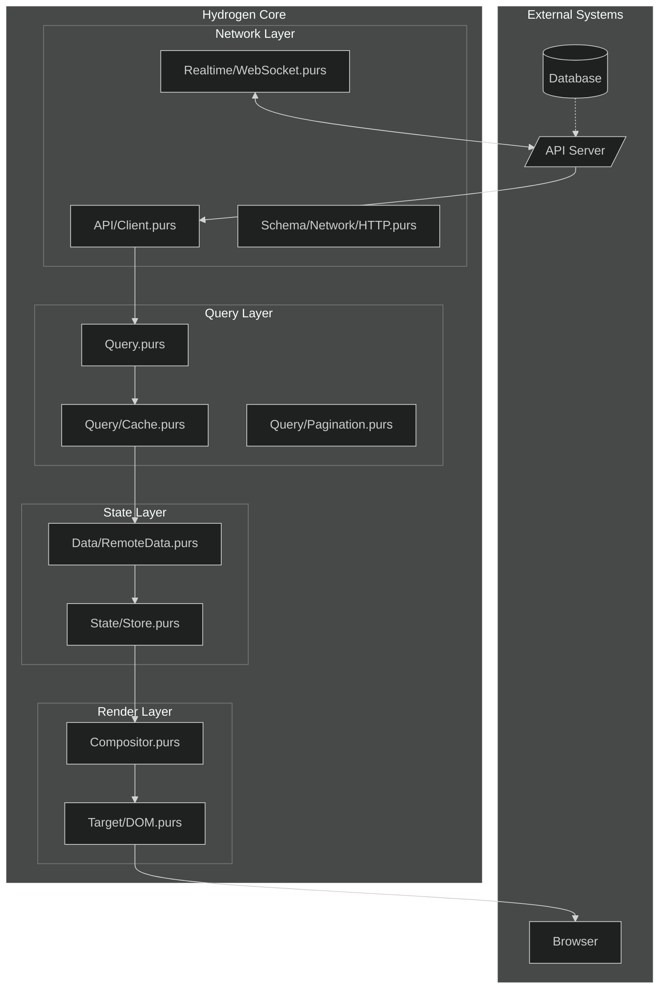

# Hydrogen System Architecture

```
━━━━━━━━━━━━━━━━━━━━━━━━━━━━━━━━━━━━━━━━━━━━━━━━━━━━━━━━━━━━━━━━━━━━━━━━━━━━━━━━
                                                          // SYSTEM // OVERVIEW
━━━━━━━━━━━━━━━━━━━━━━━━━━━━━━━━━━━━━━━━━━━━━━━━━━━━━━━━━━━━━━━━━━━━━━━━━━━━━━━━
```

## Core Statistics

| Metric | Count |
|--------|------:|
| **Total PureScript Files** | 2,014 |
| **Schema Pillars** | 39 |
| **Schema Files** | 1,107 |
| **Lean Proof Files** | 110 |
| **Proven Theorems** | 1,694 |
| **Unproven (sorry)** | 0 |

---

## High-Level Architecture

```
┌─────────────────────────────────────────────────────────────────────────────┐
│                              HYDROGEN                                        │
│                     Pure Rendering Abstraction                               │
├─────────────────────────────────────────────────────────────────────────────┤
│                                                                              │
│  ┌────────────────┐    ┌────────────────┐    ┌────────────────┐             │
│  │   PureScript   │    │     Lean4      │    │    Runtime     │             │
│  │    (Define)    │───▶│    (Prove)     │───▶│   (Execute)    │             │
│  └────────────────┘    └────────────────┘    └────────────────┘             │
│         │                      │                     │                       │
│         ▼                      ▼                     ▼                       │
│  ┌────────────────┐    ┌────────────────┐    ┌────────────────┐             │
│  │  Element DSL   │    │   Theorems     │    │  Target DOM    │             │
│  │  Schema Atoms  │    │   Invariants   │    │  Target Canvas │             │
│  │  Compounds     │    │   Properties   │    │  Target WebGL  │             │
│  └────────────────┘    └────────────────┘    └────────────────┘             │
│                                                                              │
└─────────────────────────────────────────────────────────────────────────────┘
```

---

## Module Dependency Graph

```
┌─────────────────────────────────────────────────────────────────────────────┐
│                            DEPENDENCY LAYERS                                 │
├─────────────────────────────────────────────────────────────────────────────┤
│                                                                              │
│  Layer 0: Foundation                                                         │
│  ┌──────────┐ ┌──────────┐ ┌──────────┐ ┌──────────┐ ┌──────────┐          │
│  │ Bounded  │ │ Numeric  │ │ Identity │ │ Priority │ │   Math   │          │
│  └────┬─────┘ └────┬─────┘ └────┬─────┘ └────┬─────┘ └────┬─────┘          │
│       │            │            │            │            │                  │
│       └────────────┴────────────┴────────────┴────────────┘                  │
│                              │                                               │
│  Layer 1: Visual Primitives  ▼                                               │
│  ┌──────────┐ ┌──────────┐ ┌──────────┐ ┌──────────┐ ┌──────────┐          │
│  │  Color   │ │Dimension │ │ Geometry │ │Typography│ │ Surface  │          │
│  └────┬─────┘ └────┬─────┘ └────┬─────┘ └────┬─────┘ └────┬─────┘          │
│       │            │            │            │            │                  │
│       └────────────┴────────────┴────────────┴────────────┘                  │
│                              │                                               │
│  Layer 2: Composition        ▼                                               │
│  ┌──────────┐ ┌──────────┐ ┌──────────┐ ┌──────────┐ ┌──────────┐          │
│  │Elevation │ │ Temporal │ │  Motion  │ │ Reactive │ │  Brand   │          │
│  └────┬─────┘ └────┬─────┘ └────┬─────┘ └────┬─────┘ └────┬─────┘          │
│       │            │            │            │            │                  │
│       └────────────┴────────────┴────────────┴────────────┘                  │
│                              │                                               │
│  Layer 3: Interaction        ▼                                               │
│  ┌──────────┐ ┌──────────┐ ┌──────────┐ ┌──────────┐ ┌──────────┐          │
│  │ Gestural │ │  Haptic  │ │  Audio   │ │Sensation │ │  A11y    │          │
│  └────┬─────┘ └────┬─────┘ └────┬─────┘ └────┬─────┘ └────┬─────┘          │
│       │            │            │            │            │                  │
│       └────────────┴────────────┴────────────┴────────────┘                  │
│                              │                                               │
│  Layer 4: Spatial/Physics    ▼                                               │
│  ┌──────────┐ ┌──────────┐ ┌──────────┐ ┌──────────┐ ┌──────────┐          │
│  │ Spatial  │ │ Physics  │ │ Weather  │ │ Physical │ │  Canvas  │          │
│  └────┬─────┘ └────┬─────┘ └────┬─────┘ └────┬─────┘ └────┬─────┘          │
│       │            │            │            │            │                  │
│       └────────────┴────────────┴────────────┴────────────┘                  │
│                              │                                               │
│  Layer 5: Domain             ▼                                               │
│  ┌──────────┐ ┌──────────┐ ┌──────────┐ ┌──────────┐ ┌──────────┐          │
│  │   Game   │ │  Phone   │ │  Text    │ │Scheduling│ │  Media   │          │
│  └────┬─────┘ └────┬─────┘ └────┬─────┘ └────┬─────┘ └────┬─────┘          │
│       │            │            │            │            │                  │
│       └────────────┴────────────┴────────────┴────────────┘                  │
│                              │                                               │
│  Layer 6: Compute            ▼                                               │
│  ┌──────────┐ ┌──────────┐ ┌──────────┐ ┌──────────┐ ┌──────────┐          │
│  │  Tensor  │ │   GPU    │ │ Compute  │ │  Graph   │ │Engineering│         │
│  └────┬─────┘ └────┬─────┘ └────┬─────┘ └────┬─────┘ └────┬─────┘          │
│       │            │            │            │            │                  │
│       └────────────┴────────────┴────────────┴────────────┘                  │
│                              │                                               │
│  Layer 7: Infrastructure     ▼                                               │
│  ┌──────────┐ ┌──────────┐ ┌──────────┐ ┌──────────┐ ┌──────────┐          │
│  │ Network  │ │ Storage  │ │Attestation│ │Navigation│ │ Epistemic│          │
│  └────┬─────┘ └────┬─────┘ └────┬─────┘ └────┬─────┘ └────┬─────┘          │
│       │            │            │            │            │                  │
│       └────────────┴────────────┴────────────┴────────────┘                  │
│                              │                                               │
│  Layer 8: Element & Render   ▼                                               │
│  ┌──────────┐ ┌──────────┐ ┌──────────┐ ┌──────────┐ ┌──────────┐          │
│  │ Element  │ │  Render  │ │Compositor│ │  Target  │ │   SSG    │          │
│  └──────────┘ └──────────┘ └──────────┘ └──────────┘ └──────────┘          │
│                                                                              │
└─────────────────────────────────────────────────────────────────────────────┘
```

---

## Mermaid: Complete System Graph



---

## Mermaid: Schema Pillar Relationships



---

## Mermaid: Runtime Data Flow



---

## Mermaid: Proof Architecture



---

## Scope Graph: Module Visibility



---

## Complete Module Tree

```
hydrogen/
├── src/Hydrogen/
│   ├── Core Entry Points
│   │   ├── Compositor.purs          # Main composition engine
│   │   ├── Convention.purs          # Coding conventions
│   │   ├── Query.purs               # Data fetching/caching
│   │   ├── Router.purs              # Type-safe routing
│   │   ├── Schema.purs              # Schema re-exports
│   │   └── SSG.purs                 # Static site generation
│   │
│   ├── Schema/ (39 pillars, 1,107 files)
│   │   ├── Bounded.purs             # Core bounded type infrastructure
│   │   │
│   │   ├── Visual Foundation
│   │   │   ├── Color/        (58)   # sRGB, P3, LAB, OKLCH, ACES, CDL
│   │   │   ├── Dimension/    (47)   # SI units, device units, spacing
│   │   │   ├── Geometry/     (91)   # Shapes, NURBS, quaternions
│   │   │   ├── Typography/   (36)   # OpenType, metrics, scales
│   │   │   ├── Surface/      (45)   # Gradients, noise, textures
│   │   │   └── Elevation/    (10)   # Shadows, z-index, depth
│   │   │
│   │   ├── Motion & Animation
│   │   │   ├── Motion/      (169)   # Effects, layers, expressions
│   │   │   └── Temporal/     (39)   # Easing, springs, keyframes
│   │   │
│   │   ├── Interaction
│   │   │   ├── Reactive/     (48)   # States, validation, focus
│   │   │   ├── Gestural/     (31)   # Touch, pointer, keyboard
│   │   │   ├── Haptic/        (4)   # Vibration, tactile
│   │   │   └── Navigation/    (3)   # Routing, pagination
│   │   │
│   │   ├── Sensory
│   │   │   ├── Audio/        (44)   # Synthesis, MIDI, spatial
│   │   │   └── Sensation/    (13)   # Proprioceptive, environmental
│   │   │
│   │   ├── 3D & Spatial
│   │   │   ├── Spatial/      (67)   # 3D, PBR, XR, scene graphs
│   │   │   ├── Physics/      (24)   # Forces, collision, cloth
│   │   │   ├── Weather/      (18)   # Atmosphere, precipitation
│   │   │   ├── Physical/     (33)   # Optical, mechanical, thermal
│   │   │   └── Canvas/        (4)   # 2D canvas primitives
│   │   │
│   │   ├── Domain-Specific
│   │   │   ├── Game/         (28)   # Entity, chess, poker, dice
│   │   │   ├── Phone/        (25)   # Country codes, validation
│   │   │   ├── Text/         (16)   # Rich text, code, selection
│   │   │   ├── Scheduling/    (8)   # Calendar, events
│   │   │   ├── Engineering/   (9)   # CAD, GD&T, tolerances
│   │   │   └── Epistemic/     (6)   # Affect, alignment, coherence
│   │   │
│   │   ├── Compute
│   │   │   ├── Tensor/        (8)   # DType, shape, layout
│   │   │   ├── GPU/           (8)   # Landauer, storable types
│   │   │   ├── Compute/       (5)   # ML graphs, DAG ops
│   │   │   ├── Graph/        (19)   # Layout algorithms, viewport
│   │   │   └── Numeric/       (4)   # Error tracking, graded monads
│   │   │
│   │   ├── Infrastructure
│   │   │   ├── Brand/        (37)   # Design tokens, themes
│   │   │   ├── Network/      (21)   # HTTP, WebSocket, SSE
│   │   │   ├── Storage/       (4)   # Clipboard, IndexedDB
│   │   │   ├── Attestation/  (12)   # Cryptographic, UUID5
│   │   │   └── Accessibility/ (6)   # WAI-ARIA 1.2
│   │   │
│   │   ├── Storage & Media
│   │   │   ├── Media/         (6)   # Audio, video, image
│   │   │   └── Brush/        (68)   # Brush tips, presets
│   │   │
│   │   └── Utility
│   │       ├── Identity/      (1)   # Temporal identity
│   │       └── Element/       (5)   # Core UI primitives
│   │
│   ├── Element/ (UI Compounds)
│   │   ├── Atom/                    # Primitive elements
│   │   ├── Molecule/                # Simple compositions
│   │   ├── Compound/                # Complex components
│   │   │   ├── Charts/              # Gauge, Heatmap, Pie, etc.
│   │   │   └── VideoConference/     # Grid, Tile, Controls, etc.
│   │   └── Template/                # Page templates
│   │
│   ├── Render/
│   │   ├── Element/                 # Element rendering
│   │   │   ├── HTML.purs
│   │   │   └── SVG.purs
│   │   └── Static/                  # Static rendering
│   │
│   ├── Target/
│   │   ├── DOM.purs                 # Browser DOM
│   │   ├── Canvas.purs              # 2D Canvas
│   │   ├── WebGL.purs               # 3D WebGL
│   │   └── Static.purs              # HTML strings
│   │
│   ├── Runtime Modules
│   │   ├── API/                     # HTTP client
│   │   ├── Auth/                    # Authentication
│   │   ├── Data/                    # RemoteData, etc.
│   │   ├── Query/                   # Caching, pagination
│   │   ├── State/                   # State management
│   │   └── Event/                   # Event handling
│   │
│   ├── Feature Modules
│   │   ├── A11y/                    # Accessibility runtime
│   │   ├── Analytics/               # Tracking
│   │   ├── Animation/               # Animation runtime
│   │   ├── Audio/                   # Audio runtime
│   │   ├── Chart/                   # Chart rendering
│   │   ├── Editor/                  # Rich text editing
│   │   ├── Form/                    # Form handling
│   │   ├── Geo/                     # Geolocation
│   │   ├── GPU/                     # GPU compute
│   │   ├── I18n/                    # Internationalization
│   │   ├── Icon/                    # Icon system
│   │   ├── Layout/                  # Layout algorithms
│   │   ├── Media/                   # Media playback
│   │   ├── Motion/                  # Motion runtime
│   │   ├── Offline/                 # Offline support
│   │   ├── Optimize/                # Optimization
│   │   ├── Portal/                  # Portal rendering
│   │   ├── Realtime/                # WebSocket/SSE
│   │   ├── Tour/                    # Guided tours
│   │   └── UI/                      # UI utilities
│   │
│   └── Utility
│       ├── Math/                    # Math utilities
│       ├── Serialize/               # CBOR/JSON
│       ├── Style/                   # CSS-in-PureScript
│       ├── Util/                    # General utilities
│       └── HTML/                    # HTML utilities
│
├── proofs/Hydrogen/ (110 Lean files, 1,694 theorems)
│   ├── Math/        (18)            # Vec, Mat, Quaternion proofs
│   ├── Schema/      (17)            # Brand, Color, Brush proofs
│   ├── WorldModel/  (19)            # Consent, Rights, Integrity
│   ├── Optimize/     (6)            # Submodular, RAOCO proofs
│   ├── Camera/       (4)            # Projection, lens proofs
│   ├── Light/        (6)            # Attenuation, shadow proofs
│   ├── Material/     (5)            # BRDF, ISP proofs
│   ├── Geometry/     (5)            # Bounds, mesh proofs
│   ├── Scene/        (5)            # Graph, diff proofs
│   ├── Layout/       (3)            # ILP, Presburger proofs
│   ├── GPU/          (3)            # Landauer, precision proofs
│   └── Scale/        (2)            # Aggregation proofs
│
├── test/
│   ├── Main.purs                    # Test entry point
│   └── Adversarial/                 # Adversarial testing
│       ├── Bounds.purs              # Boundary conditions
│       ├── Identity.purs            # Identity properties
│       ├── State.purs               # State transitions
│       └── Temporal.purs            # Temporal invariants
│
└── docs/
    ├── schema/       (64 files)     # Pillar documentation
    ├── SCHEMA.md                    # Schema overview
    ├── design-ontology.md           # Type system docs
    └── ARCHITECTURE.md              # This file
```

---

## Mermaid: Data Flow Through Schema Layers

```mermaid
%%{init: {'theme': 'dark'}}%%
flowchart TB
    subgraph Input["User Input"]
        I1[/"Describe: Blue button with shadow"/]
    end

    subgraph Atoms["Atomic Resolution"]
        A1["Color.SRGB { r: 59, g: 130, b: 246 }"]
        A2["Dimension.Pixel 200"]
        A3["Elevation.Shadow { blur: 8, spread: 2 }"]
    end

    subgraph Molecules["Molecular Composition"]
        M1["Surface.Solid color"]
        M2["Geometry.Rectangle size"]
        M3["Elevation.DropShadow config"]
    end

    subgraph Compounds["Compound Assembly"]
        C1["Reactive.Clickable state"]
        C2["Brand.Button variant"]
    end

    subgraph Element["Element Output"]
        E1["Element Msg"]
    end

    subgraph Target["Render Target"]
        T1["DOM Node"]
        T2["Canvas Draw"]
        T3["WebGL Mesh"]
    end

    I1 --> A1
    I1 --> A2
    I1 --> A3

    A1 --> M1
    A2 --> M2
    A3 --> M3

    M1 --> C2
    M2 --> C2
    M3 --> C2
    C2 --> C1

    C1 --> E1

    E1 --> T1
    E1 --> T2
    E1 --> T3
```



---

## Mermaid: Proof-Code Correspondence



---

## Cross-Module Communication



---

```
━━━━━━━━━━━━━━━━━━━━━━━━━━━━━━━━━━━━━━━━━━━━━━━━━━━━━━━━━━━━━━━━━━━━━━━━━━━━━━━━
                                                            // end // of // doc
━━━━━━━━━━━━━━━━━━━━━━━━━━━━━━━━━━━━━━━━━━━━━━━━━━━━━━━━━━━━━━━━━━━━━━━━━━━━━━━━
```
