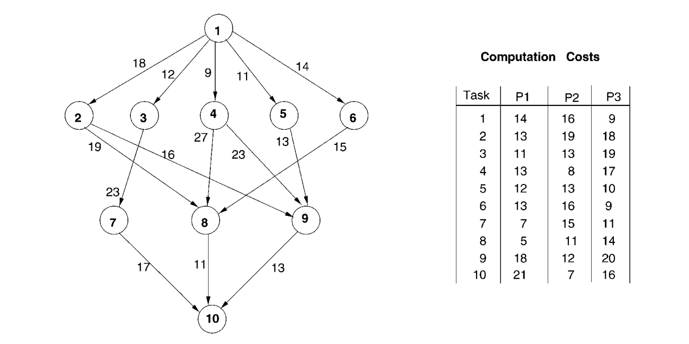
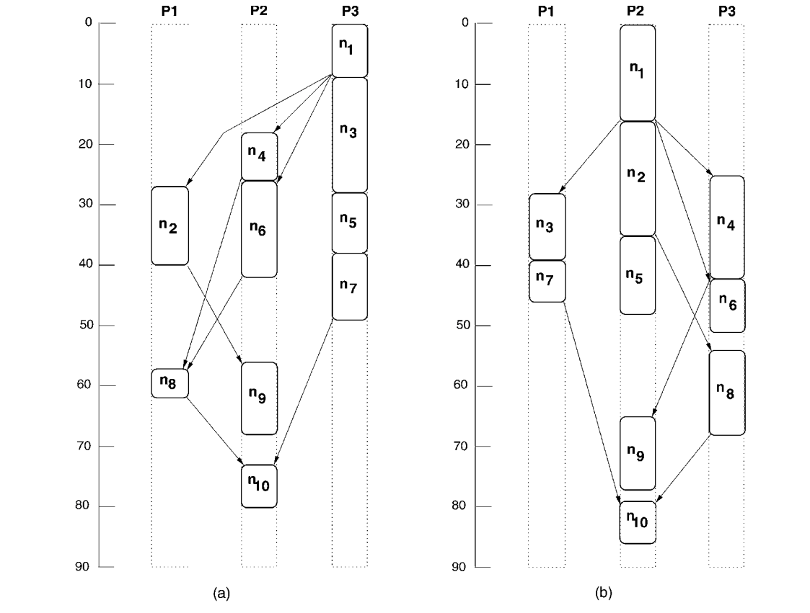
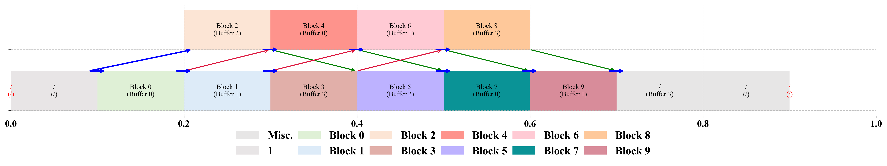
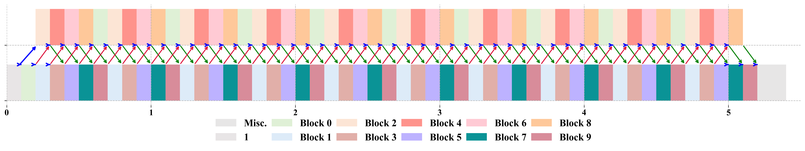
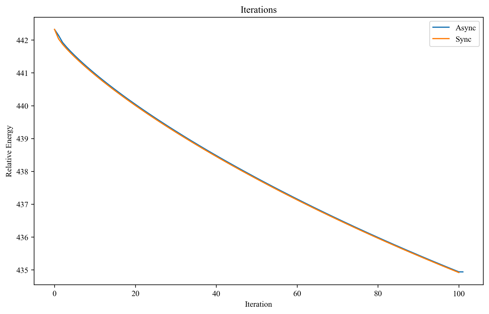
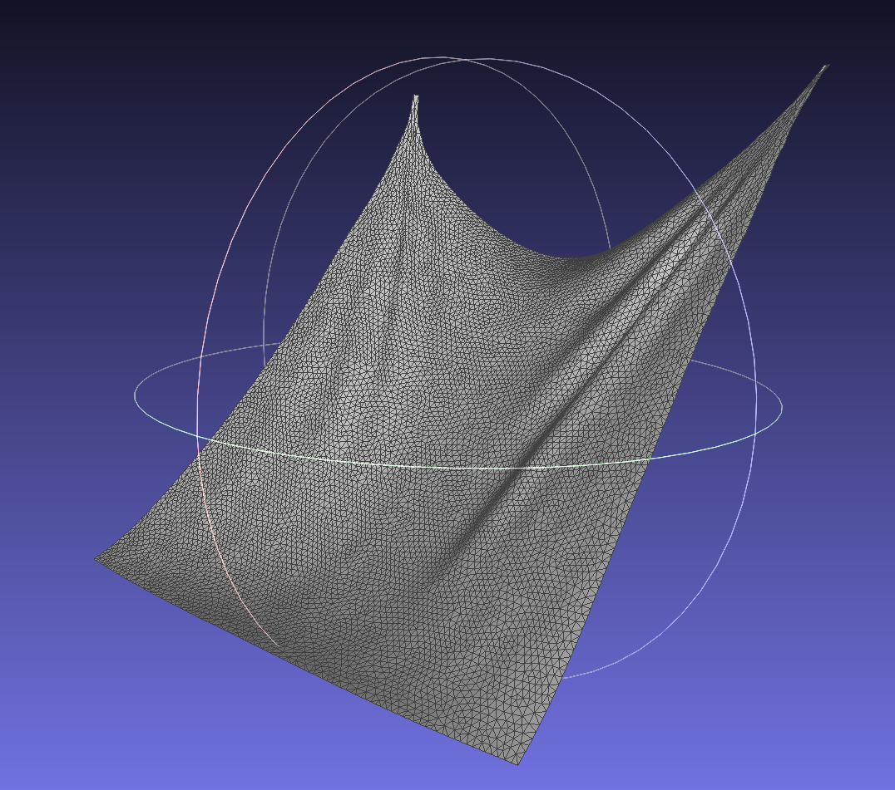
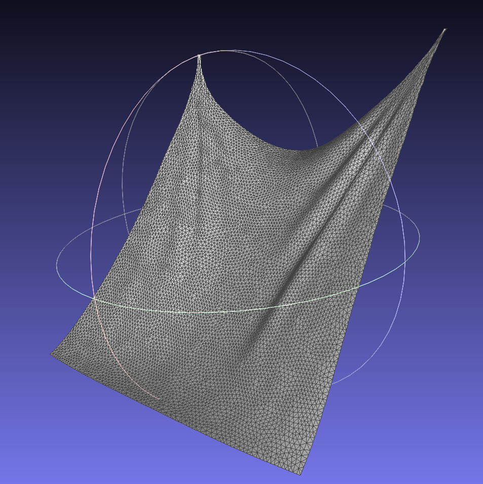
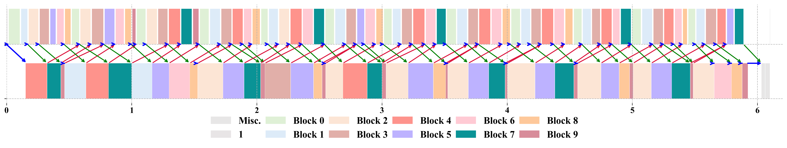

# libAtsSim

Code for SIGGRAPH 2025 conference paper "Auto Task Scheduling for Cloth and Deformable Simulation on Heterogeneous Environments".

Authors: [Chengzhu He](https://chengzhuuwu.github.io/), [Zhendong Wang](https://wangzhendong619.github.io/), Zhaorui Meng, [Junfeng Yao](https://cdmc.xmu.edu.cn/), [Shihui Guo](https://www.humanplus.xyz/), [Huamin Wang](https://wanghmin.github.io/).

<!-- [Download Paper](https://chengzhuuwu.github.io/files/ats_camera_ready.pdf) -->

<!-- <video src="movie.mp4.mp4" controls="controls" width="500" height="300"></video> -->

We provided several examples to show our scheduler and asynchronous iteration progress.

## Example 1: Simplist HEFT case

This example shows how HEFT algorithm makes scheduling, we use the original case given by the paper ["Performance-effective and low-complexity task scheduling for heterogeneous computing"](https://ieeexplore.ieee.org/document/993206) (IEEE TPDS 2002, H. Topcuoglu et. al.).

Given the DAG (represent the relationship between tasks) and the computation matrix of each task on each devices, how do we make schedling that allocated each tasks into devices?



HEFT algorithm will quantify the dependency of each task ($rank_u$) and sorted them. Based on the sorted task list, the scheduler then allocated each tasks into the devices with the ealiest-finish-time (EFT). The scheduling result should be (a) in the following figure (figure (b) is scheduled based on another scheduling algorithm "CPOP"): 



The final time (represented the finished time of the latest task across all devices, $n_{10}$) should be 91.

> Speedup to proc 0 = 39.56% (From 127.00 to 91.00 ) 
>
> Speedup to proc 1 = 42.86% (From 130.00 to 91.00 ) 
>
> Speedup to proc 2 = 57.14% (From 143.00 to 91.00 )

Our HEFT implementation is based on a [python-version heft](https://github.com/mackncheesiest/heft), which is the source code of paper ["Performant, Multi-Objective Scheduling of Highly Interleaved Task Graphs on Heterogeneous System on Chip Devices"](https://ieeexplore.ieee.org/document/9653796) (IEEE TPDS 2022, [Joshua Mack](https://github.com/mackncheesiest/) et. al.).

### HEFT scheduling algorithm

1. Rrepresent the relationship between tasks as **DAG**(Directed Acyclic Graph): In DAG, each node represent for each tasks, each edge represent for the relying dependencies (e.g., broadphase collision detection should complete before narrowphase collision detection. If two tasks perform on different devices, we may need to copy the relative data to target device). 

- In practical, we can save the information of **edges** in node's data structrue as two lists: predecessors, and successors (of each node).

2. Topology sorting: By perfoming ropology soring, we can get a ordered list, which generates an ordered table that ensures the dependencies between tasks (Which means by execute tasks in the order of this list, we can ensure that the dependencies of each task can be satisfied). 

- We can use DFS-based or BFS-based tojpology sorting. Both methods can satisfy the dependencies, however, we recommend using the DFS-based (Depth First Traversal) topology sorting, which tends to group a set of tasks with tighter relationships together, making it easier for us to perform tasks merging and other operations in the future. In addition, the topology sorting method based on DFS can also facilitate us to identify the loops in DAG

3. (Optional) We cab execute the sorted list in sequence several times, to obtain the **computation matrix** for each task. and **communication matrix** between devices. For UMA (Unified Memory Architecture), the communication matrix is a constant matrix (About 0.2ms accross decices).

4. $rank_u$ calculation: We traverse the *reverse order* of list by topology sorting, and for each node $i$, we calculte its $rank_u$ value as (Condiering we have $m$ processors): 

$$ rank_u [i] = \frac{1}{m} \sum_{p \in \text{processors}} \text{comp}[i][p] + \max_{j \in \text{successors}} (rank_u[j] + \frac{1}{m} \sum_{p \in \text{processors}} \text{comm}[i][j][p] ) $$

- Which means we calculate $rank_u$ from the last task to the first task. $rank_u$ represents the **estimated time** span from the current task to the last task. It quantifies the dependency of each task. If a task has more subsequent tasks, it represents a higher degree of dependency, that is, its $rank_u$ value will also be higher. 

5. EFT calculation and task assignment: We traverse the task list sorted in reverse order by $rank_u$, and calculate the EFT (Eerlest Finish Time) of each task on different devices. We use the device with the smallest EFT value as the inserted device. 

    - Since We need to satisfy the dependency relationship between tasks, so the earliest execution time of the task must **not be earlier than the finish time of its predecessors** (if its predecessors are executed on other devices, the communication cost between devices also needs to be considered)

    - How do to calculate EFT: Researchers will divide the time average into discrete timestamps (e.g., 100 or 1000 timestamps), traverse these timestamps, and calculate the earlist available time. This method is inefficient and relies on timestamp partitioning. We refer to the implentation from [python-version heft](https://github.com/mackncheesiest/heft), which only need to consider the following situations (Given the ealist start time `ready_time`):

    1. Empty schedule → Task starts at `ready_time`.
    2. Before the first task → If there’s enough gap, start at `ready_time`.
    3. Between two tasks → If a gap is large enough, start after the finish time of the first task.
    4. After the last task → Start after the finish time of the last task.
    5. Fallback → Default to starting at `ready_time`.

You can also refer [Our Pre-Presentation](https://www.youtube.com/watch?v=ZH2Jcpsg7J0&t=4s) in SIGGRAPH for more detail.


## Example 2: Asychronous iteration on VBD

This example shows the difference between the original iteration pipeline and our asynchronous iteration pileline. Considering we have allocated iteration tasks (different clusters in [Vertex Block Descent](https://ankachan.github.io/Projects/VertexBlockDescent/index.html), SIGGRAPH 2024, Anka He Chen et. al.) into 2 devices, then how do we make data transfering? 

This example only considering the simplist case: costs of tasks is a constant value $t_c$ and the comminication delay is exactly the same value $t_c$, then we make make the data transfering as follows:



> Different lines means different devices. Here the upper line refers to tasks on GPU and the lower line refers to CPU.

If we considering the overlapping across iterations (such as 10 iterations):



> Figures that visualizing the scheduling reult is generated by "documents/example2_scheduling_result.py".

We use mass-spring streching and quadratic bending model, this can also extended to other linear or non-linear energy model.

The convergent rate between sync-based simulation and async-based simulation is nearly the same (in some cases, async-based will convergent faster, especially considering collision energy). However, we will get about 90% speedup compared to single device implementation (From 10.30ms to 5.40ms):



> Figures that visualizing the convergence rate of async-based and sync-based simulation (the 30 th frame convergence result with 100 iterations each frame, timestep h=1/60s) is generated by "documents/example2_async_convergence.py".

The simulation result in the 30th frame:

| Async_Result | Sync_Result |
|--------------|-------------|
|  |  |

Note that:

- In this paper, we summarize the potential communication scenarios between devices. In practice, we specify the communication rules through the scheduling result, this is actually a forward process, not a reverse one:

```python

# Step 0: Make scheduling
task_schedules = {}
proc_schedules = {}
task_schedules, proc_schedules = make_schediling()
size(task_schedules) == num_tasks # The scheduling result for each tasks
size(proc_schedules) == num_procs # num_procs == 2 for CPU/GPU
size(proc_schedules[0]) + size(proc_schedules[1]) == num_tasks

# Step 1: Find the shortest connection of each task between deivices
list_in = {{} for each tasks}
list_out = {{} for each tasks}
for proc in procs:
    for schedule in proc_schedules[proc]:
        tid = schedule.task_id
        if not is_constraint_task[tid]: 
            continue

        for another_schedule in proc_schedules[another_proc, another_proc != proc]:
            another_tid = another_schedule.task_id
            comm_time = communication_cost_matrix[proc][another_proc];
            if is_constraint_task[another_tid] and schedule.end + comm_time <= another_schedule.start:
                list_in[tid] = {another_tid}
                list_out[another_tid] = {list_out[another_tid], tid}
```

Then we will merge redundant waiting between tasks:

```python
# Step 2: Merge redundant connections
# Step 2.1: For non-main devices (e.g., CPUs)
for proc in procs where not is_main_device[proc]:
    for task in proc_schedules[proc]:
        inputs = list_in[task]

        if |inputs| > 1:
            keep = inputs.last
            for input in inputs[0 : end-1]:
                remove_edge(input → task)   # drop redundant connections
            list_in[task] = {keep}

        if |inputs| > 0:
            connect(inputs.last, task)

# Step 2.2: For main device (e.g., GPU)
for proc in procs where is_main_device[proc]:
    for task in proc_schedules[proc]:
        inputs = list_in[task]

        if |inputs| > 1:
            keep_set = {}
            for i in 0 .. |inputs|-2:
                input = inputs[i]
                next_task = next_of(input)

                if |list_in[next_task]| == 0:
                    remove_edge(input → task)   # prioritize intra-device transfer
                else:
                    keep_set.add(input)

            keep_set.add(inputs.last)
            list_in[task] = keep_set

        if |inputs| > 0:
            for input in inputs:
                connect(input, task)
```

Finally we can specify the buffer indices from the newly added data transfer:

```python
# Step 3: Specify the data communication and buffer index

buffer_idx ← 0
task_buffers[tid] ← -1  for all tid
left_task[proc] ← -1   for all proc

# Traverse schedules of CPU and GPU in time order
while not finished(cpu_schedule, gpu_schedule):
    task ← next_task_in_time(cpu_schedule, gpu_schedule)
    tid  ← task.id

    if is_constraint_task[tid]:
        selected_buffer ← -1

        # Case 1: Task has input dependencies
        if |list_in[tid]| > 0:
            for in_tid in list_in[tid]:
                buf ← task_buffers[in_tid]
                selected_buffer ← buf
                record_connection(in_tid → tid, buf)

                if left_task[task.proc] ≠ -1:
                    left_tid ← left_task[task.proc]
                    if should_weight(left_tid, task.proc):
                        buf_left ← task_buffers[left_tid]
                        record_left_connection(left_tid → tid, buf_left)

        # Case 2: Task has no input dependencies
        else:
            left_tid ← left_task[task.proc]
            if left_tid ≠ -1 and list_out[left_tid] is empty:
                # Reuse buffer from left task
                selected_buffer ← task_buffers[left_tid]
            else:
                # Allocate a new buffer
                selected_buffer ← buffer_idx++
                if left_tid ≠ -1:
                    record_copy(left_tid → tid, task_buffers[left_tid], selected_buffer)
                else:
                    mark_as_first_iterative_task(tid)

        # Assign buffer index to current task
        task_buffers[tid] ← selected_buffer
        task.buffer_idx   ← selected_buffer
        left_task[task.proc] ← tid
```

In the run-time, we need to get data from the input_buffer_index/left_buffer_idx/buffer_index:

```cpp

function copy_from_A_to_B(InputBUfferIdxA, OutputBufferIdxB):
    get_begin_buffer(last(OutputBufferIdxB)) = get_curr_buffer(InputBUfferIdxA)
    get_curr_buffer(last(OutputBufferIdxB)) = get_curr_buffer(InputBUfferIdxA)

function launch_iterative_task(task):
    # Prev-processing
    # Case 1: Weighted combination of inputs buffer and left buffer
    if |input_buffer_idxs| > 0 and left_buffer_idx != null:
        for each input_buffer_idx in input_buffer_idxs:
            begin_buf ← (param.is_allocated_to_main_device) 
                        ? get_begin_buffer(input_buffer_idx)
                        : get_begin_buffer(left_buffer_idx)
            parallel_for vertices vid:
                solve_conflict(vid, 
                               input_buffer_idx, 
                               iter_buffer(input_buffer_idx), 
                               iter_buffer(left_buffer_idx), 
                               weight)

    # Case 2: Copy from input buffer
    else if |input_buffer_idxs| > 0 and left_buffer_idx == null:
        copy_from_A_to_B(input_buffer_idxs, buffer_idx)

    # Case 3: Copy from left buffer
    else if left_buffer_idx != null and left_buffer_idx ≠ FIRST_TASK_MASK:
        copy_from_A_to_B(left_buffer_idx, buffer_idx)

    # Case 4: Copy from predicted position (Input)
    else if left_buffer_idx = FIRST_TASK_MASK:
        copy_from_A_to_B(predicted_position_buffer_idx, buffer_idx)

    perform_iterative_task()
    
    # Post-processing
        # Copy result to the right buffer for next task
        if right_buffer_idx ≠ null:
            copy_from_A_to_B(buffer_idx, right_buffer_idx)

end function()
```

- If the data we get from devices has conflict, we need to solve the conflict on each vertex (This situation is not frequent in VBD, cause that the vertices, which is the object that we weight, are not overlapped due to the per-vertex coloring. However, in constraint-wise method like XPBD, the conflict through contraint is happened frequently). We we need to specify the common start point for both devices. The finding-common-start-point strategy is not the same for main-device and .
- Per-vertex copying/weighting still demonstrate some cost, we have not yet modeled these costs into HEFT pipeline. Minimizing the data copying/weighting will be a great future work.

## Example 3: Asychronous iteration with CPU-GPU implementation

This example shows how do we use our heterogenous framework in a simulation application. After we register the implementation and specify DAG, the our scheduler will automatically make scheuling including: calculating the communication matrix, allocating the tasks into devices, specifying the data tranfers, and update communication matrix each frame.

We use Metal-shading-language for GPU implementation, so this example is only supported on MacOS.

On each frame, we can use the run-time profiling time to update our compuatation matrix. We can see the scheduling time (theoratical) and the actual run-time (with hybrid implementation): 

>   In Frame  0 : Hybrid Cost/Desire = 90.28/45.92, speedup = 279.23%/386.23% to GPU/CPU (profile time = 174.15/223.29), scheuling cost = 334.06
>
>   In Frame  1 : Hybrid Cost/Desire = 84.09/52.34, speedup = 89.36%/198.95% to GPU/CPU (profile time = 99.10/156.46), scheuling cost = 0.20
>
>   In Frame  2 : Hybrid Cost/Desire = 75.67/61.40, speedup = 58.83%/169.94% to GPU/CPU (profile time = 97.53/165.76), scheuling cost = 0.21

After several frames, we can obtain the compuatation matrix that is closer to the actual execution time.

> In Frame 57 : Hybrid Cost/Desire = 65.69/61.16, speedup = 51.93%/208.75% to GPU/CPU (profile time = 92.92/188.84), scheuling cost = 0.17
>
> In Frame 58 : Hybrid Cost/Desire = 67.03/60.84, speedup = 55.89%/209.98% to GPU/CPU (profile time = 94.83/188.58), scheuling cost = 0.25
>
> In Frame 59 : Hybrid Cost/Desire = 64.34/62.06, speedup = 49.57%/200.48% to GPU/CPU (profile time = 92.82/186.48), scheuling cost = 0.18

We can visualize the scheduling result based on the compuation matrix in the 30th frame:



In our hybrid Metal/cpp environment, a problem is that how do we perform the waiting events.

> TODO: Write the algorithm to specify the launching list

Considering we have merged tasks on each device into several task-list and the wait/signal value of them, then we create `MTL::SharedEvent event` object, and we first send GPU command of each GPU tasks in different `MTL::CommandBuffer` object and manage them as `std::vector<MTL::CommandBuffer*> cmd_list`, after that we launch CPU tasks.

We excute the waiting events as follows (Considering we have specify the wait/signal number):

- CPU signal for GPU (i'th CPU task signal for j'th GPU task): Call `event->setSignaledValue(i)`
- GPU signal for CPU (i'th GPU task signal for j'th CPU task): No other things to do
- CPU wait GPU (i'th CPU task wait for j'th GPU task): Call `cmd_list[j]->waitUntilCompleted()` 
- GPU wait CPU (i'th GPU task wait for j'th CPU task): Call `cmd_list[j]->encodeWait(event, i + 1)` when compiling GPU command


## Dependencies

The library itself depends only on glm and TBB. 

> brew install glm
>
> brew install tbb
>

or for windows:

> vcpkg install glm
>
> vcpkg install tbb
>

For windows users, TBB installed by vcpkg might only use debug or release mode. You may need to set the vcpkg path in Cmake file (src/CmakeLists.txt): 

> set(CMAKE_PREFIX_PATH   "~~~/vcpkg/installed/x64-windows") # Replace it with your vcpkg path

Example 3 can only run on MacOS due to our Metal based GPU implementation. You also need to install [XCode](https://developer.apple.com/xcode/) for Metal command line tools.

(Linux system has not been tested yet...)

## Others

If you have any questions on our methods or our source code, please feel free to [contact me](https://chengzhuuwu.github.io/) **at any time**!!!

## Important Update

2025.9.12: Fix the compile issue on MacOS platform.

2025.8.30: Fix the compile issue on Windows platform.

2025.5.25: Fix the wrong calculation of enertia energy and gradient.

2025.5.13: We find the logical problem in asynchronous iteration that "Copy from left buffer" operation should be done in the previous tasks, otherwise it may get the buffer from futher iterated task (on another devices).

2025.5.13: Add pre-profiling computation matrix for Example3.

TODO: Asynchronous iteration weighting progress
TODO: Cross-Device signal progress
